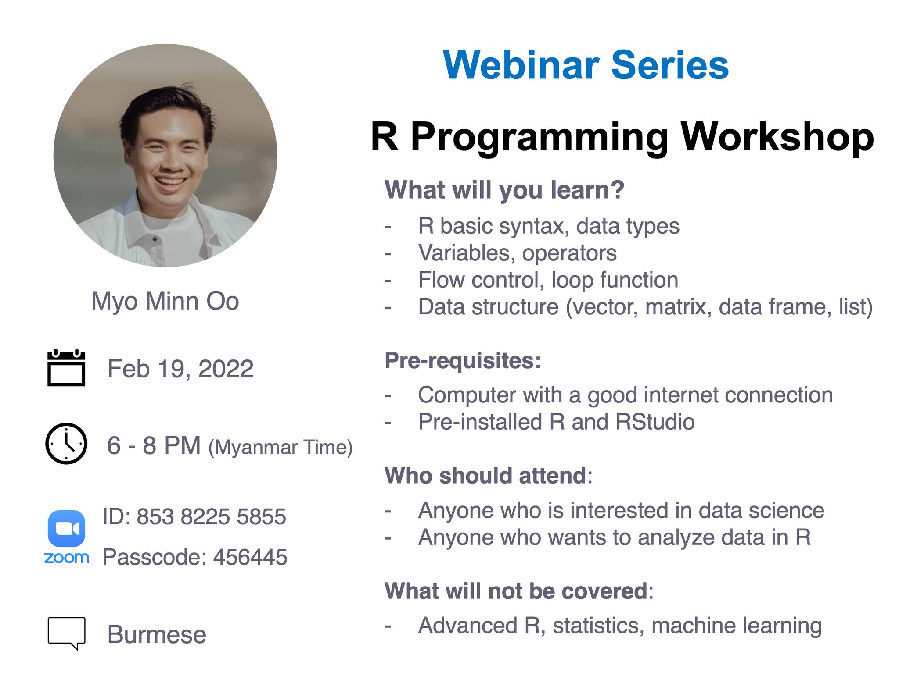
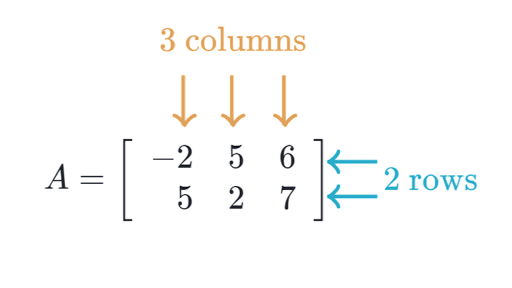
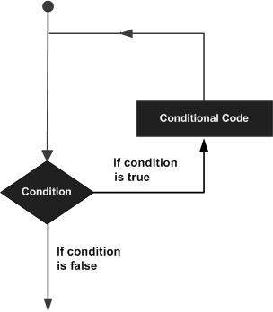
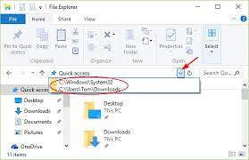

## Who is this webinar for? 

This webinar is designed for anyone who is looking forward for developing statistical software using R programming. 

If you are trying to understand the R programming language as a beginner, this webinar will also give you enough understanding on almost all the concepts of the language from where you can take yourself to higher levels of expertise.

## What is R? 

- a programming language 
- software environment for statistical analysis, graphics representation and reporting

> R was created by Ross Ihaka and Robert Gentleman at the University of Auckland, New Zealand, and is currently developed by the R Development Core Team. 

R is freely available under the GNU General Public License, and pre-compiled binary versions are provided for various operating systems like Linux, Windows and Mac. This programming language was named `R`, based on the first letter of first name of the two `R` authors (Robert Gentleman and Ross Ihaka), and partly a play on the name of the Bell Labs Language `S`.

## Features of R
As stated earlier, R is a programming language and software environment for statistical analysis, graphics representation and reporting. The following are the important features of R ???

- R is a well-developed, simple and effective programming language which includes conditionals, loops, user defined recursive functions and input and output facilities.

- R has an effective data handling and storage facility,

- R provides a suite of operators for calculations on arrays, lists, vectors and matrices.

- R provides a large, coherent and integrated collection of tools for data analysis.

- R provides graphical facilities for data analysis and display either directly at the computer or printing at the papers.

As a conclusion, R is world\\'s most widely used statistics programming language. It's the 1 choice of data scientists and supported by a vibrant and talented community of contributors. R is taught in universities and deployed in mission critical business applications. This tutorial will teach you R programming along with suitable examples in simple and easy steps.


## Credits 

To [tutorialspoint](https://www.tutorialspoint.com/r/):

# R Basics 

## Command Prompt

It is easy to start your R command prompt by just typing the following command at your command prompt. 

```{r}
"hello"
```

`##` indicates an output.

You can use R as calculator. 

```{r}
2 + 3
```

## Data Types

Why do we need to know data types in R? Because you need to use various variables to store various information. Variables are nothing but reserved memory locations to store values. This means that, when you create a variable you reserve some space in memory.

You may like to store information of various data types like character, wide character, integer, floating point, double floating point, Boolean etc. Based on the data type of a variable, the operating system allocates memory and decides what can be stored in the reserved memory.

- Vectors
- Lists
- Matrices
- Data Frames

## Vectors 

The `simplest` of these objects is the **vector object** and there are six data types of these atomic vectors, also termed as six classes of vectors. The other R-Objects are built upon the atomic vectors.

We don't need to know all. 

### Character

They are also called texts and strings. Characters always should be encapsulated with quotes. 

```{r}
"hello"

my_greeting <- "hello"
my_greeting
print(my_greeting)
(my_greeting)
```

### numeric 

```{r}
23.5
my_number <- 23.5
my_number
```

### Integer

They usually have capital letter `L` behind them.
```{r}
3L
my_integer <- 3L
my_integer
```

### Boolean or logical

TRUE or FALSE

```{r}
my_boo <- TRUE 
my_boo 

my_boo <- FALSE
my_boo
```


### Missing value 

```{r}
NA
# NA + "hello"  ## this will bring an error
NA + 23.5
NA + 3L 
NA == TRUE
NA == FALSE 
```

`==` checks if the left side is equal to the right side.

### Combining vectors 
When you want to create vector with more than one element, you should use `c()` function which means to combine the elements into a vector.


```{r}
# Create a vector.
apple <- c('red','green',"yellow")
apple

my_numbers <- c(23.5, 41.9, 36.2)
my_numbers

my_boo <- c(TRUE, FALSE, TRUE, TRUE)
my_boo

my_missing <- c(NA, NA, NA)
```

### Checking data types

```{r}
str(apple)
str(my_numbers)
str(my_boo)
str(my_missing)

class(apple)
class(my_numbers)
class(my_boo)
class(my_missing)
```

> Vectors can contain only one data type. 

## Matrix or matrices


*** 




A matrix is a two-dimensional rectangular data set. It can be created using a vector input to the matrix function.

```{r}
M <- matrix( c('a','b','c','d','e','f'), nrow = 2)
M

M <- matrix( c('a','b','c','d','e','f'), ncol = 2)
M

M <- matrix( c('a','b','c','d','e','f'), nrow = 2, byrow = TRUE)
M
```

> Matrices can also contain only one data type. 

## Data Frames

- excel sheet 
- has rows and columns
- in statistics, columns are variables and rows are observations. 
- It can store data of different types.
- one column only one data type

```{r}
# Create the data frame.
BMI <- 	data.frame(
   gender = c("Male", "Male","Female"), 
   height = c(152, 171.5, 165), 
   weight = c(81,93, 78),
   Age = c(42,38,26)
)

BMI
```


## Others
### Array, Factors 

They are not super important right now. Let's skip! 


# Basic Environment management 

- what you have run so far are stored under Global Environment. 

## Finding Variables
To know all the variables currently available in the workspace we use the `ls()` function. Also the `ls()` function can use patterns to match the variable names.


```{r}
ls()
```

## Hidden variables 
The variables starting with `dot(.)` are hidden, they can be listed using "`all.names = TRUE`" argument to `ls()` function.

```{r}
.my_hidden_variable <- "this variable is hidden"
.my_hidden_variable

ls()
ls(all.name = TRUE)
```
## Deleting Variables
Variables can be deleted by using the `rm() `function. Below we delete the variable var.3. On printing the value of the variable error is thrown.

```{r}
rm(apple)
ls()

rm(my_boo, my_integer)
ls()
```

## What if you want to delete them all? 

```{r}
rm(list = ls())
ls()
```

# Operators

An operator is a symbol that tells the compiler to perform specific mathematical or logical manipulations. R language is rich in built-in operators and provides following types of operators.

## Types of Operators
We have the following types of operators in R programming ???

- Arithmetic Operators
- Relational Operators
- Logical Operators
- Assignment Operators
- Miscellaneous Operators

### Arithmetic Operators

#### + Adds two vectors

```{r}
2 + 3

v <- c(2, 5.5, 6)
v 
t <- c(8, 3, 4)
t
v + t
```


#### - Subtracts second vector from the first

```{r}
2 - 3

v - t
```


#### * Multiplies both vectors	

```{r}
2 * 3

v * t
```

#### / Divides the first vector with the second

```{r}
2 / 3

v / t
```


#### %% Gives the remainder of the first vector with the second

```{r}
2 %% 3

v %% t
```


#### %/% Gives the result of division of first vector with second (quotient)

```{r}
2 %/% 3

v %/% t 
```


#### ^ means the first vector raised to the exponent of second vector

```{r}
2 ^ 3

v ^ t
```


### Relational Operators

Each element of the first vector is compared with the corresponding element of the second vector. The result of comparison is a Boolean value.

#### > greater than 
```{r}
2 > 3 
v > t
```
#### >= greater than or equal to
```{r}
2 >= 3 
v >= t
```
#### < less than 
```{r}
2 < 3 
v < t
```
#### <= less than or equal to 
```{r}
2 <= 3 
v <= t
```

#### == equal to 
```{r}
2 == 3 
v == t
```

#### != not equal to 
```{r}
2 != 3 
v != t
```


### Logical Operators
It is applicable only to vectors of type logical, numeric or complex. 

Each element of the first vector is compared with the corresponding element of the second vector. The result of comparison is a Boolean value.

#### & 

It is called Element-wise Logical `AND` operator. It combines each element of the first vector with the corresponding element of the second vector and gives a output `TRUE` if both the elements are `TRUE.`

```{r}
v > 2 
v < 3

(v > 2) & (v < 3)
```

#### |
It is called Element-wise Logical `OR` operator. It combines each element of the first vector with the corresponding element of the second vector and gives a output `TRUE` if one the elements is `TRUE.`

```{r}
(v > 2) | (v < 3)
```

#### !

It is called Logical `NOT` operator. Takes each element of the vector and gives the opposite logical value.


```{r}
!(v < 3)
```


### Assignment Operators

These operators are used to assign values to vectors.


#### Left assignment operators

```{r}
v1 <- c(3, 1, TRUE, 2+3i)
v1
v2 <<- c(3, 1, TRUE, 2+3i)
v2
v3 = c(3, 1, TRUE, 2+3i)
v3
```


#### Right assignment operators

```{r}
c(3, 1, TRUE, 2+3i) -> v1 
v1
c(3, 1, TRUE, 2+3i) ->> v2
v2
```

### Miscellaneous Operators

These operators are used to for specific purpose and not general mathematical or logical computation.

#### : colon
Colon operator. It creates the series of numbers in sequence for a vector.

```{r}
v <- 2:8
v
```

#### %in% 
This operator is used to identify if an element belongs to a vector.

```{r}
v1 <- 8
v2 <- 12
t <- 1:10

v1 %in% t
v2 %in% t

t %in% v1 
t %in% v2
```

# Decision making 

Decision making structures require the programmer to specify one or more conditions to be evaluated or tested by the program, along with a statement or statements to be executed if the condition is determined to be true, and optionally, other statements to be executed if the condition is determined to be false.

Following is the general form of a typical decision making structure found in most of the programming languages ???


R provides the following types of decision making statements. Click the following links to check their detail.


|No.        |Description        |
|-|:------------------|
|1|`if` statement: An `if` statement consists of a Boolean expression followed by one or more statements.|
|2|`if...else` statement: An `if` statement can be followed by an optional `else` statement, which executes when the Boolean expression is false.|
|3|`switch` statement: A `switch` statement allows a variable to be tested for equality against a list of values.|


## Loops

There may be a situation when you need to execute a block of code several number of times. In general, statements are executed sequentially. The first statement in a function is executed first, followed by the second, and so on.

Programming languages provide various control structures that allow for more complicated execution paths.

A loop statement allows us to execute a statement or group of statements multiple times and the following is the general form of a loop statement in most of the programming languages. 



R programming language provides the following kinds of loop to handle looping requirements. Click the following links to check their detail.


|No. |Description |
|-|:------------|
|1|`repeat` loop: Executes a sequence of statements multiple times and abbreviates the code that manages the loop variable.|
|2|`while` loop: Repeats a statement or group of statements while a given condition is true. It tests the condition before executing the loop body.|
|3|`for` loop: Like a while statement, except that it tests the condition at the end of the loop body.|


`Loop control statements` change execution from its normal sequence. When execution leaves a scope, all automatic objects that were created in that scope are destroyed.

R supports the following control statements. Click the following links to check their detail.

|No. |Description |
|-|:------------|
|1|break statement: Terminates the loop statement and transfers execution to the statement immediately following the loop.|
|2|Next statement: The next statement simulates the behavior of R switch.|

```{r}
for (i in 1:3) {
    print(i)
}
```
```
for (i in 1:100) {
    print("I love you!")
}
```

# Functions 

A function is a set of statements organized together to perform a specific task. R has a large number of in-built functions and the user can create their own functions.


## Function Definition
An R function is created by using the keyword function. The basic syntax of an R function definition is as follows ???

```
function_name <- function(arg_1, arg_2, ...) {
   Function body 
}
```

## Function Components
The different parts of a function are ???

- `Function Name` ??? This is the actual name of the function. It is stored in R environment as an object with this name.

- `Arguments` ??? An argument is a placeholder. When a function is invoked, you pass a value to the argument. Arguments are optional; that is, a function may contain no arguments. Also arguments can have default values.

- `Function Body` ??? The function body contains a collection of statements that defines what the function does.

- `Return Value` ??? The return value of a function is the last expression in the function body to be evaluated.

R has many `built-in` or pre-installed functions which can be directly called in the program without defining them first. We can also create and use our own functions referred as `user defined` functions.

## Built-in Function

Simple examples of in-built functions are `seq()`, `mean()`, `max()`, `sum(x)` and `paste(...)` etc. They are directly called by user written programs. You can refer most widely used R functions.

```{r}
# Create a sequence of numbers from 32 to 44.
(seq(32,44))

# Find mean of numbers from 25 to 82.
(mean(25:82))

# Find sum of numbers frm 41 to 68.
(sum(41:68))
```

## Calling a Function without an Argument

```{r}
ls()
getwd()
dir()
```


# String manipulation

Any value written within a pair of single quote or double quotes in R is treated as a string. Internally R stores every string within double quotes, even when you create them with single quote.


```{r}
a <- 'Start and end with single quote'
print(a)

b <- "Start and end with double quotes"
print(b)

c <- "single quote ' in between double quotes"
print(c)

d <- 'Double quotes " in between single quote'
print(d)
```


## Concatenating Strings - paste() function

Many strings in R are combined using the paste() function. It can take any number of arguments to be combined together.

**Syntax**
The basic syntax for paste function is 
```
paste(..., sep = " ", collapse = NULL)
```
Following is the description of the parameters used ???

- `...` represents any number of arguments to be combined.
- `sep` represents any separator between the arguments. It is optional.
- `collapse` is used to eliminate the space in between two strings. But not the space within two words of one string.


How do you know this? Check its help page by typing `?paste`. 

```
?paste
```

Here is an example.

```{r}
a <- "Hello"
b <- 'How'
c <- "are you? "

print(paste(a,b,c))

print(paste(a,b,c, sep = "-"))

print(paste(a,b,c, sep = "", collapse = ""))
```

### Counting number of characters in a string - nchar() function

This function counts the number of characters including spaces in a string.

```
?nchar
```

```{r}
nchar("Count the number of characters")
```

### Changing the case - toupper() & tolower() functions
These functions change the case of characters of a string.

```{r}
# Changing to Upper case.
toupper("Changing To Upper")

# Changing to lower case.
tolower("Changing To Lower")
```

# Data Frame 

A data frame is a table or a two-dimensional array-like structure in which each column contains values of one variable and each row contains one set of values from each column.

Following are the characteristics of a data frame.

- The column names should be non-empty.
- The row names should be unique.
- The data stored in a data frame can be of numeric, factor or character type.
- Each column should contain same number of data items.


```{r}
# Create the data frame.
emp.data <- data.frame(
   emp_id = c (1:5), 
   emp_name = c("Rick","Dan","Michelle","Ryan","Gary"),
   salary = c(623.3,515.2,611.0,729.0,843.25), 
   start_date = as.Date(c("2012-01-01", "2013-09-23", "2014-11-15", "2014-05-11",
      "2015-03-27")),
   stringsAsFactors = FALSE
)
emp.data
```

## Get the Structure of the Data Frame
The structure of the data frame can be seen by using `str()` function.

```{r}
str(emp.data)
```


## Summary of Data in Data Frame

The statistical summary and nature of the data can be obtained by applying `summary()` function.

```{r}
summary(emp.data)
```


## Extract Data from Data Frame
Extract specific column from a data frame using column name.

```{r}
emp.data$emp_id
emp.data[, 1]
emp.data$emp_name
emp.data[, 2]
emp.data[, 1:2]
emp.data[, c(1, 2)]
emp.data[, 2:4]
```


Extract the first two rows and all columns. 

```{r}
emp.data[1:2, ]
```
Extract 3rd and 5th row with 2nd and 4th column

```{r}
emp.data[c(3, 5), c(2, 4)]
```

## Expand Data Frame
A data frame can be expanded by adding columns and rows.

### Add Column
Just add the column vector using a new column name.

```{r}
# Add the "dept" coulmn.
emp.data$dept <- c("IT","Operations","IT","HR","Finance")
emp.data
```

### Add Row
To add more rows permanently to an existing data frame, we need to bring in the new rows in the same structure as the existing data frame and use the rbind() function.

In the example below we create a data frame with new rows and merge it with the existing data frame to create the final data frame.

```{r}
## First data frame 
emp.data

# Create the second data frame
emp.newdata <- 	data.frame(
   emp_id = c (6:8), 
   emp_name = c("Rasmi","Pranab","Tusar"),
   salary = c(578.0,722.5,632.8), 
   start_date = as.Date(c("2013-05-21","2013-07-30","2014-06-17")),
   dept = c("IT","Operations","Fianance"),
   stringsAsFactors = FALSE
)

# Bind the two data frames.
emp.finaldata <- rbind(emp.data, emp.newdata)
emp.finaldata
```


# Importing CSV Files

In R, we can read data from files stored outside the R environment. We can also write data into files which will be stored and accessed by the operating system. R can read and write into various file formats like csv, excel, xml etc.

In this chapter we will learn to read data from a csv file and then write data into a csv file. The file should be present in current working directory so that R can read it. Of course we can also set our own directory and read files from there.

## Getting and Setting the Working Directory
You can check which directory the R workspace is pointing to using the `getwd()` function. You can also set a new working directory using `setwd()` function.

```{r}
# Get and print current working directory.
getwd()

# Set current working directory.
setwd("/Users/myominnoo/GoogleDrive/GitHub/webinars/2022/02/R Programming")

getwd()
```

**For windows users**



backward slash `\` - put two slashes to work `\\`

```
setwd("C:\\Users\\jd\\Documents\\data\\")
```

forward slash `/` - this is okay.

```
setwd("C:/Users/jd/Documents/data/")
```

Following is a simple example of `read.csv()` function to read a CSV file available in your current working directory ???

```{r}
data <- read.csv("data/input.csv")
data

str(data)
ncol(data)
nrow(data)
```

## Get the maximum salary

```{r}
# Get the max salary from data frame.
max_salary <- max(data$salary)
max_salary 
```


## Get the details of the person with max salary
We can fetch rows meeting specific filter criteria similar to a SQL where clause.

```{r}
# Get the person detail having max salary.
person_max_salary <- subset(data, salary == max(salary))
person_max_salary
```


## Get all the people working in IT department

```{r}
it_people <- subset(data, dept == "IT")
it_people
```


## Get the persons in IT department whose salary is greater than 600
```{r}
info <- subset(data, salary > 600 & dept == "IT")
info
```


# Writing into a CSV File
R can create csv file form existing data frame. The write.csv() function is used to create the csv file. This file gets created in the working directory.

```{r}
# Create a data frame.
data <- read.csv("data/input.csv")
info <- subset(data, salary > 600 & dept == "IT")

# Write filtered data into a new file.
write.csv(info,"data/info.csv")

newdata <- read.csv("data/info.csv")
newdata
```

Something is weird with `newdata`. 

```{r}
# Write filtered data into a new file.
write.csv(info,"data/info.csv", row.names = FALSE)
newdata <- read.csv("data/info.csv")
newdata
```


# Importing Excel File
Microsoft Excel is the most widely used spreadsheet program which stores data in the .xls or .xlsx format. R can read directly from these files using some excel specific packages. Few such packages are - XLConnect, xlsx, gdata etc. We will be using readxl package. R can also write into excel file using this package.


## Install xlsx Package
You can use the following command in the R console to install the `readxl` package. It may ask to install some additional packages on which this package is dependent. Follow the same command with required package name to install the additional packages.

```
install.packages("readxl")
```

## Load the `readxl` Package
Use the following command to verify and load the `readxl` package.

```{r}
# Load the library into R workspace.
library("readxl")
```

## Reading the Excel File
The input `.xlsx` is read by using the `read_excel()` function as shown below. The result is stored as a data frame in the R environment.

```{r}
# Read the first worksheet in the file input .xlsx.
data <- read_excel("data/input.xlsx")
data

str(data)
dim(data)
ncol(data)
nrow(data)
```

