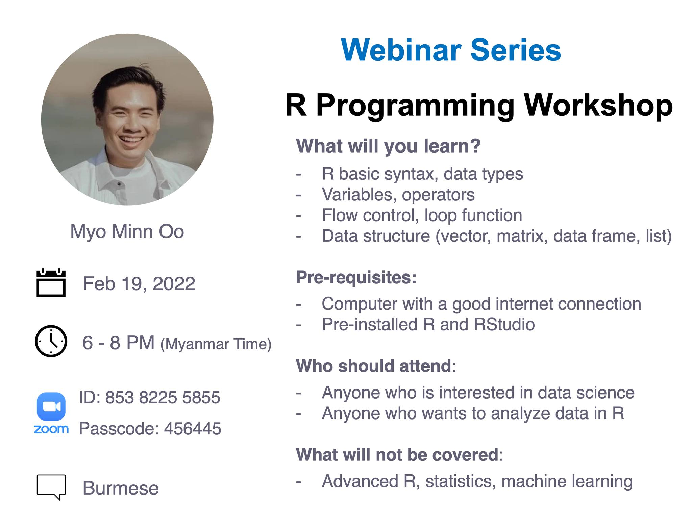
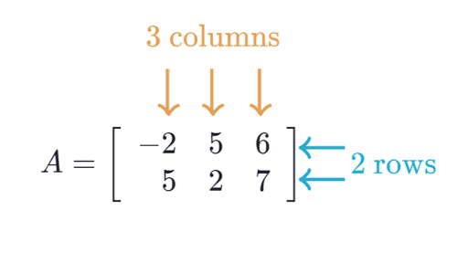

# R Programming Webinar



## Who is this webinar for?

This webinar is designed for anyone who is looking forward for
developing statistical software using R programming.

If you are trying to understand the R programming language as a
beginner, this webinar will also give you enough understanding on almost
all the concepts of the language from where you can take yourself to
higher levels of expertise.

## What is R?

-   a programming language
-   software environment for statistical analysis, graphics
    representation and reporting

> R was created by Ross Ihaka and Robert Gentleman at the University of
> Auckland, New Zealand, and is currently developed by the R Development
> Core Team.

R is freely available under the GNU General Public License, and
pre-compiled binary versions are provided for various operating systems
like Linux, Windows and Mac. This programming language was named `R`,
based on the first letter of first name of the two `R` authors (Robert
Gentleman and Ross Ihaka), and partly a play on the name of the Bell
Labs Language `S`.

## Features of R

As stated earlier, R is a programming language and software environment
for statistical analysis, graphics representation and reporting. The
following are the important features of R ???

-   R is a well-developed, simple and effective programming language
    which includes conditionals, loops, user defined recursive functions
    and input and output facilities.

-   R has an effective data handling and storage facility,

-   R provides a suite of operators for calculations on arrays, lists,
    vectors and matrices.

-   R provides a large, coherent and integrated collection of tools for
    data analysis.

-   R provides graphical facilities for data analysis and display either
    directly at the computer or printing at the papers.

As a conclusion, R is worldžs most widely used statistics programming
language. It’s the \# 1 choice of data scientists and supported by a
vibrant and talented community of contributors. R is taught in
universities and deployed in mission critical business applications.
This tutorial will teach you R programming along with suitable examples
in simple and easy steps.

## Credits

To [tutorialspoint](https://www.tutorialspoint.com/r/):

# R Basics

## Command Prompt

Itžs easy to start your R command prompt by just typing the following
command at your command prompt.

``` r
"hello"
```

    ## [1] "hello"

`##` indicates an output.

You can use R as calculator.

``` r
2 + 3
```

    ## [1] 5

## Data Types

Why do we need to know data types in R? Because you need to use various
variables to store various information. Variables are nothing but
reserved memory locations to store values. This means that, when you
create a variable you reserve some space in memory.

You may like to store information of various data types like character,
wide character, integer, floating point, double floating point, Boolean
etc. Based on the data type of a variable, the operating system
allocates memory and decides what can be stored in the reserved memory.

-   Vectors
-   Lists
-   Matrices
-   Data Frames

## Vectors

The `simplest` of these objects is the **vector object** and there are
six data types of these atomic vectors, also termed as six classes of
vectors. The other R-Objects are built upon the atomic vectors.

We don’t need to know all.

### Character

They are also called texts and strings. Characters always should be
encapsulated with quotes.

``` r
"hello"
```

    ## [1] "hello"

``` r
my_greeting <- "hello"
my_greeting
```

    ## [1] "hello"

``` r
print(my_greeting)
```

    ## [1] "hello"

``` r
(my_greeting)
```

    ## [1] "hello"

### numeric

``` r
23.5
```

    ## [1] 23.5

``` r
my_number <- 23.5
my_number
```

    ## [1] 23.5

### Integer

They usually have capital letter `L` behind them.

``` r
3L
```

    ## [1] 3

``` r
my_integer <- 3L
my_integer
```

    ## [1] 3

### Boolean or logical

TRUE or FALSE

``` r
my_boo <- TRUE 
my_boo 
```

    ## [1] TRUE

``` r
my_boo <- FALSE
my_boo
```

    ## [1] FALSE

### Missing value

``` r
NA
```

    ## [1] NA

``` r
# NA + "hello"  ## this will bring an error
NA + 23.5
```

    ## [1] NA

``` r
NA + 3L 
```

    ## [1] NA

``` r
NA == TRUE
```

    ## [1] NA

``` r
NA == FALSE 
```

    ## [1] NA

`==` checks if the left side is equal to the right side.

### Combining vectors

When you want to create vector with more than one element, you should
use `c()` function which means to combine the elements into a vector.

``` r
# Create a vector.
apple <- c('red','green',"yellow")
apple
```

    ## [1] "red"    "green"  "yellow"

``` r
my_numbers <- c(23.5, 41.9, 36.2)
my_numbers
```

    ## [1] 23.5 41.9 36.2

``` r
my_boo <- c(TRUE, FALSE, TRUE, TRUE)
my_boo
```

    ## [1]  TRUE FALSE  TRUE  TRUE

``` r
my_missing <- c(NA, NA, NA)
```

### Checking data types

``` r
str(apple)
```

    ##  chr [1:3] "red" "green" "yellow"

``` r
str(my_numbers)
```

    ##  num [1:3] 23.5 41.9 36.2

``` r
str(my_boo)
```

    ##  logi [1:4] TRUE FALSE TRUE TRUE

``` r
str(my_missing)
```

    ##  logi [1:3] NA NA NA

``` r
class(apple)
```

    ## [1] "character"

``` r
class(my_numbers)
```

    ## [1] "numeric"

``` r
class(my_boo)
```

    ## [1] "logical"

``` r
class(my_missing)
```

    ## [1] "logical"

> Vectors can contain only one data type.

## Matrix or matrices


------------------------------------------------------------------------



A matrix is a two-dimensional rectangular data set. It can be created
using a vector input to the matrix function.

``` r
M <- matrix( c('a','b','c','d','e','f'), nrow = 2)
M
```

    ##      [,1] [,2] [,3]
    ## [1,] "a"  "c"  "e" 
    ## [2,] "b"  "d"  "f"

``` r
M <- matrix( c('a','b','c','d','e','f'), ncol = 2)
M
```

    ##      [,1] [,2]
    ## [1,] "a"  "d" 
    ## [2,] "b"  "e" 
    ## [3,] "c"  "f"

``` r
M <- matrix( c('a','b','c','d','e','f'), nrow = 2, byrow = TRUE)
M
```

    ##      [,1] [,2] [,3]
    ## [1,] "a"  "b"  "c" 
    ## [2,] "d"  "e"  "f"

> Matrices can also contain only one data type.

## Data Frames

-   excel sheet
-   has rows and columns
-   in statistics, columns are variables and rows are observations.
-   It can store data of different types.
-   one column only one data type

``` r
# Create the data frame.
BMI <-  data.frame(
   gender = c("Male", "Male","Female"), 
   height = c(152, 171.5, 165), 
   weight = c(81,93, 78),
   Age = c(42,38,26)
)

BMI
```

    ##   gender height weight Age
    ## 1   Male  152.0     81  42
    ## 2   Male  171.5     93  38
    ## 3 Female  165.0     78  26

## Others

### Array, Factors

They are not super important right now. Let’s skip!

# Basic Environment management

-   what you have run so far are stored under Global Environment.

## Finding Variables

To know all the variables currently available in the workspace we use
the `ls()` function. Also the `ls()` function can use patterns to match
the variable names.

``` r
ls()
```

    ## [1] "apple"       "BMI"         "M"           "my_boo"      "my_greeting"
    ## [6] "my_integer"  "my_missing"  "my_number"   "my_numbers"
